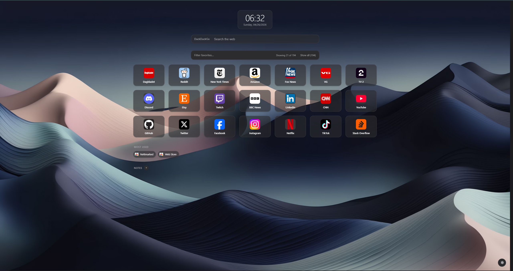
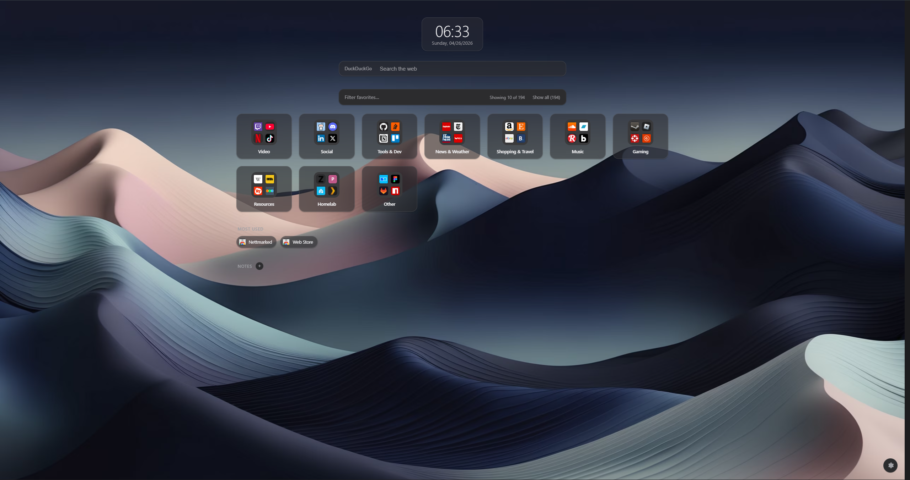
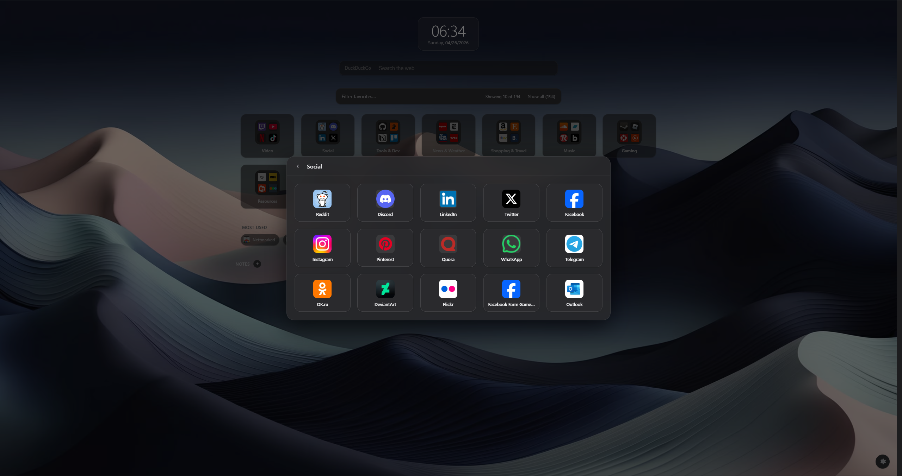

PureStart — A clean new tab page that turns your bookmarks into a real start page.
No account. No telemetry. No cloud sync. Your bookmarks stay where they already are — in your browser, on your device.
PureStart replaces Edge's default new tab with a fast, customizable page built around the bookmarks folder of your choice. Drag-and-drop organization, inline editing, and folder navigation — all synced directly with your browser's bookmark store.

Features

Favorites grid — pick any bookmarks folder and view it as a visual grid with drag-and-drop, folder navigation, and inline editing.
Auto-organized categories — optionally group loose bookmarks into virtual categories (Video, Social, Tools & Dev, News, Shopping, and more) without touching your actual bookmark structure.
Enhanced icons — fetch high-quality site icons, with optional Homelab mode for local icon services.
Built-in search — use any search engine, or a custom %s URL.
Top sites — optionally surface your most-visited sites via the browser's topSites API, with per-host exclusions.
Personalization — light, dark, or auto theme; solid colors, gradients, bundled wallpapers, or your own images; adjustable tile sizes; optional clock and notes panel.
Backup & restore — export and import all settings, notes, and custom backgrounds as a single file.

Privacy
PureStart collects nothing, sends nothing, and requires no account. Every optional network feature (icon fetching, custom backgrounds from URLs) is clearly labeled and off by default unless you turn it on.

https://microsoftedge.microsoft.com/addons/detail/purestart/lbjahhodjjgabbgpfpgjonlbhjifgedi

